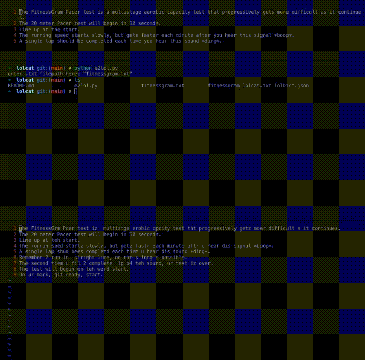

# lolcat
lolcat translater
---
### Setup:
* Download with `gh repo clone elliottyoon/lolcat`
### Usage:
* Run with `python3 e2lol.py`
* When asked for input, give the address (in quotes!) to your .txt file you would like translated
* Enjoy :)
---

